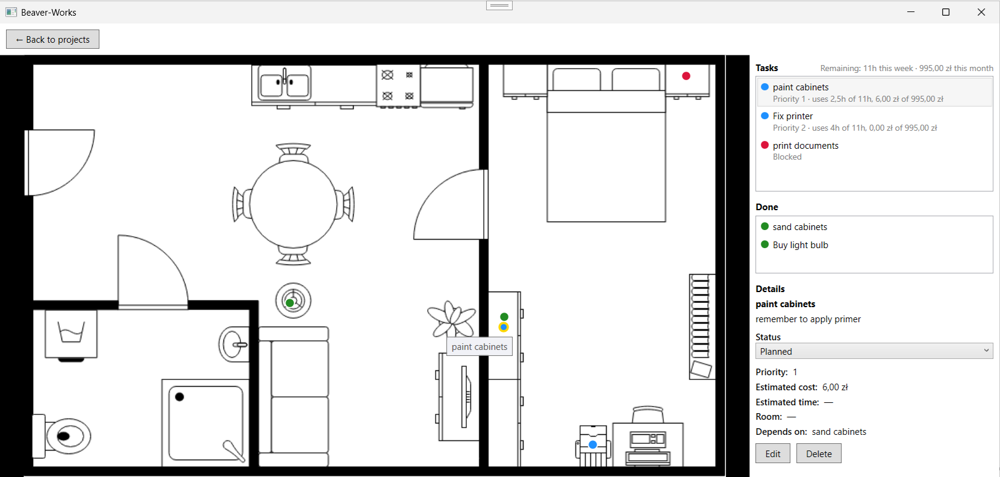

# Beaver-Works

Desktopowa aplikacja C#/WPF do planowania remontu na planie mieszkania.

## Główna funkcjonalność

Główny widok aplikacji łączy plan mieszkania z interaktywnymi markerami zadań remontowych. Zadania są powiązane z konkretnymi miejscami na planie, a aplikacja uwzględnia ich priorytety, zależności oraz status realizacji.

Na tej podstawie aplikacja pomaga określić kolejność prac, wskazuje zadania możliwe do wykonania w danym momencie oraz blokuje lub odsuwa te, które zależą od wcześniejszych etapów. Mechanizm rekomendacji dodatkowo uwzględnia dostępny budżet czasu i kosztów, proponując kolejne zadania do realizacji.



## Wymagania

- Windows
- SDK .NET 10.0.300 (wersja przypięta w global.json)
- Internet przy pierwszym pobraniu pakietów NuGet

## Struktura

- src/BeaverWorks.Desktop - interfejs WPF i MVVM
- src/BeaverWorks.Core - modele, logika i zapis danych
- tests/BeaverWorks.Core.Tests - testy logiki i zapisu
- tests/BeaverWorks.UiTests - testy interfejsu z FlaUI
- DOC - dokumentacja i ustalenia z 10x

## Uruchomienie

W PowerShell, z głównego katalogu projektu:

```powershell
dotnet restore BeaverWorks.sln
dotnet build BeaverWorks.sln --no-restore
dotnet test BeaverWorks.sln --no-build
dotnet run --project src/BeaverWorks.Desktop/BeaverWorks.Desktop.csproj --no-build
```

W Visual Studio otwórz BeaverWorks.sln i ustaw BeaverWorks.Desktop jako projekt startowy.

## Aktualny stan

- **Konto lokalne**: rejestracja i logowanie z lokalnym przechowywaniem
  poświadczeń (hasło hashowane z solą).
- **Ostatnie projekty**: lista ostatnio otwieranych projektów do szybkiego
  wznowienia pracy.
- **Projekty remontowe**: tworzenie nowego projektu (z planem mieszkania w
  formie obrazu) oraz otwieranie istniejącego.
- **Zadania na planie**: przypinanie zadań remontowych do konkretnych miejsc
  na planie, z markerem na canvasie.
- **Zarządzanie zadaniami**: tworzenie, edycja, usuwanie oraz zmiana statusu
  zadania (Planned/Active/Blocked/Done), wraz z obsługą zależności między
  zadaniami.
- **Zapis danych**: projekt (plan, zadania, pozycje markerów) zapisywany i
  odczytywany z lokalnych plików `.bwproj`.
- **Budżet**: deklarowany tygodniowy budżet czasu i miesięczny budżet
  pieniędzy, z automatycznym śledzeniem zużycia w bieżącym okresie.
- **Rekomendacje zadań**: silnik rekomendacji podpowiada kolejne zadania do
  wykonania na podstawie priorytetu, zależności i pozostałego budżetu, wraz
  z uzasadnieniem.
- **Testy**: automatyczne testy jednostkowe (`tests/BeaverWorks.Core.Tests`)
  dla modeli, usług i warstwy zapisu oraz testy integracyjne
  (`tests/BeaverWorks.Desktop.Tests`) sprawdzające zapis/odczyt projektu i
  odświeżanie widoków po edycji/usunięciu zadania.

Ustalenia produktowe: [podsumowanie 10x](DOC/beaver-works-podsumowanie.md).
Szczegóły wymagań: [context/foundation/prd.md](context/foundation/prd.md).
